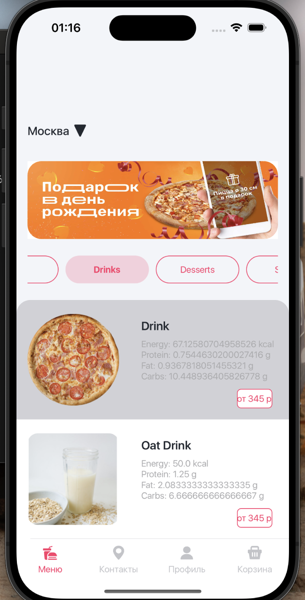
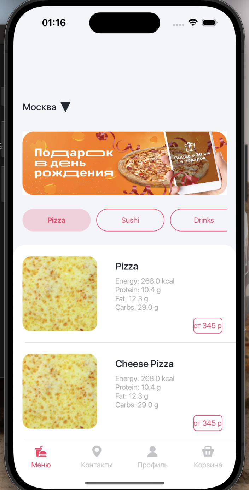
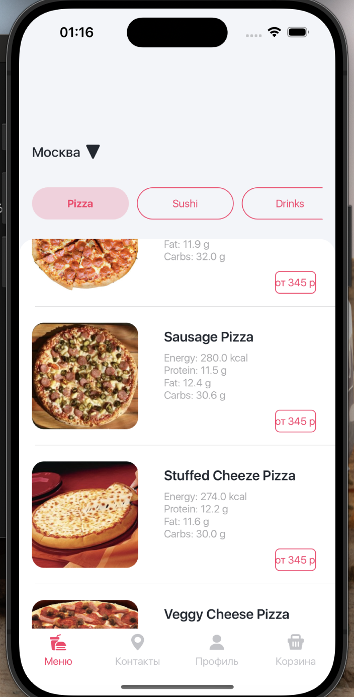

#  TestAppHammer

TestAppHammer - это инновационное iOS-приложение, использующее современные методы разработки, с упором на сетевое взаимодействие, динамическое обновление пользовательского интерфейса и эффективные стратегии навигации. Приложение создано для демонстрации различных функциональностей, включая управление продуктами питания, разделенными на разные категории, удобное управление контактами, профилями пользователей и комплексную систему корзины покупок.

#Архитектура

MVC (Model-View-Controller) & MVP (Model-View-Presenter)
* Модель:
    Слой модели в TestAppHammer охватывает структуры данных и бизнес-логику приложения. Он включает в себя сущности, такие как FoodItem, UserProfile, и структуры ответов сети, которые являются ключевыми для обработки потока данных в приложении.
* Представление:
    Компонент представления включает в себя элементы пользовательского интерфейса приложения. Он включает различные контроллеры представлений и пользовательские представления, такие как FoodItemCollectionViewCell, отвечающие за представление данных пользователю в интерактивной и привлекательной форме. Представления созданы так, чтобы быть модульными и повторно используемыми в разных частях приложения.
* Презентер:
    Слой презентера, являющийся частью архитектуры MVP, включая классы, такие как FoodItemPresenter, служит мостом между моделью и представлением. Он об рабатывает данные из модели, делая их подходящими для представления пользователем, и управляет взаимодействием с пользователем и сетевыми запросами. Соблюдение протоколов в слое презентера обеспечивает четкое разделение обязанностей и упрощает модульное тестирование.

* Сетевая связь:
    Слой сетевой связи управляет всеми коммуникациями с внешними службами и API. Он обрабатывает запросы, ответы и анализ данных, обеспечивая бесперебойный поток данных в приложении.
#Источник API
    Для своих основных функций TestAppHammer интегрирован с известными внешними API для получения и управления данными. Эти API предоставляют исчерпывающие наборы данных и утилиты, необходимые для основных функций приложения, таких как категоризация продуктов питания, управление профилями пользователей и функциональность корзины покупок.

#Функциональность

* Динамическое управление продуктами питания:
    Пользователи могут просматривать, выбирать и управлять продуктами питания, разделенными на различные категории. Эта функция поддерживается надежными моделями данных и эффективными стратегиями сетевого взаимодействия.
* Профили пользователей и контакты:
    Приложение предлагает функции для управления профилями пользователей и контактами, обеспечивая персонализированный опыт для каждого пользователя.
* Система корзины покупок:
    Интегрирована комплексная система корзины покупок, позволяющая пользователям добавлять товары, управлять количествами и проходить процесс покупки.
* Навигация на основе вкладок:
Приложение использует систему навигации на основе вкладок, обеспечивая дружественный и интуитивно понятный интерфейс пользователя.

#Структура проекта

Проект следует структурированному подходу с четко определенными каталогами для каждого компонента:

* Builder: Управляет созданием сложных объектов.
* Model: Содержит структуры данных и бизнес-логику.
* Networking: Обрабатывает все операции, связанные с сетью.
* Presenter: Содержит логику обработки данных и взаимодействия с пользователем.
* Supporting Files: Включает конфигурации и глобальные ресурсы.
* Utilities: Предоставляет общие вспомогательные функции и утилиты.
* View: Содержит пользовательские компоненты интерфейса и контроллеры представлений.
* Такой структурированный подход обеспечивает чистый и удобный для обслуживания код, способствующий эффективной разработке и сотрудничеству.

#Заключение

TestAppHammer представляет собой всесторонний пример современной разработки iOS-приложений. Используя лучшие практики в области архитектуры программного обеспечения и интегрируясь с мощными внешними API, этот проект служит надежным шаблоном для создания функционально насыщенных iOS-приложений. Его модульный дизайн и соблюдение проверенных шаблонов проектирования делают его идеальной отправной точкой для разработчиков, желающих понять и внедрить передовые концепции в разработке iOS-приложений.

